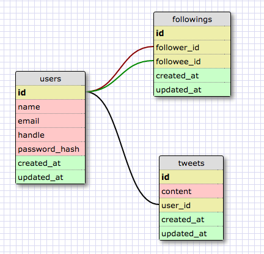

# twitter-clone

## Overview

A web application that allows users to share their thoughts in only a few
sentences.

Demo at https://twitterclonest.herokuapp.com/

## Team

* [Andrew Vathanakamsang](https://github.com/portatlas)
* [Buck Melton](https://github.com/buckmelton)
* [Kristal Lam](https://github.com/kristallam)
* [Mila Bessmann](https://github.com/ftBessmann)
* [Renan Martins](https://github.com/nbkhope)

## Technologies

* HTML
* CSS
* Bootstrap
* Ruby
* Sinatra
* PostgreSQL

## Screenshots

  
*Screenshot 1*.  Home page


  
*Screenshot 2*.  Login page


  
*Screenshot 3*.  Profile page


  
*Screenshot 4*.  New tweet page


  
*Screenshot 5*.  Profile page with tweets


  
*Screenshot 6*.  User tweets featured on home page


  
*Screenshot 7*.  A certain user's followers list


## Installation

Run bundle to install all dependencies:

```
bundle install
```

Then, create, migrate, and seed the database:

```
bundle exec rake db:create
bundle exec rake db:migrate
bundle exec rake db:seed
```

Use shotgun to run the server:

```
bundle exec shotgun config.ru
```

It will be available at [http://localhost:9393/](http://localhost:9393/)

To run the application console to play with the data and models, use:

```
bundle exec rake console
```

## Testing

You need to run the following in order to prepare the test database:

```
bundle exec rake db:test:prepare
```

If you do not do that, your rspec tests will fail.

Then, to run the tests, use:

```
bundle exec rake spec
```

## MVP Features

### Highest Priority
```
1 A user can log in and log out
1 A user can see others' profile pages with all their updates
1 A user can only post status updates of 140 characters or less
1 A user can post status updates
1 A user has a profile page
```

### Second-Highest Priority
```
2 A user has followers
2 A user can follow other users
2 A user can see a list of their followers
2 A user can see a list of who they are following
```

### Second-Lowest Priority
```
3 A user can see updates from those they are following
3 A user can see others' profile pages
```

### Lowest Priority
```
4 A user sees a responsively styled site
4 A user can retweet others' status updates
4 A user sees a styled site
4 A user can link a gravatar image
4 A user can view the site live on the web
4 A user can have a solid experience because the site is fully tested
```

## Database Schema


