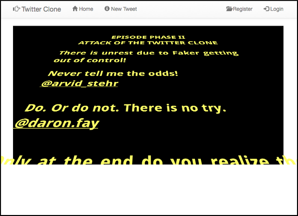
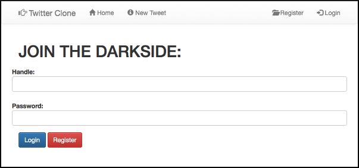
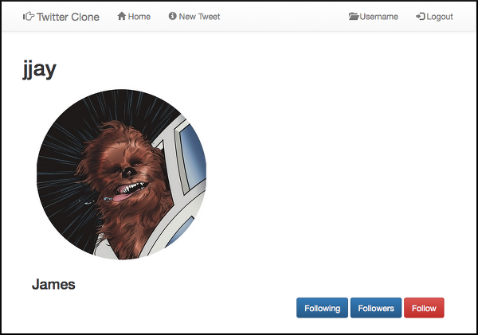
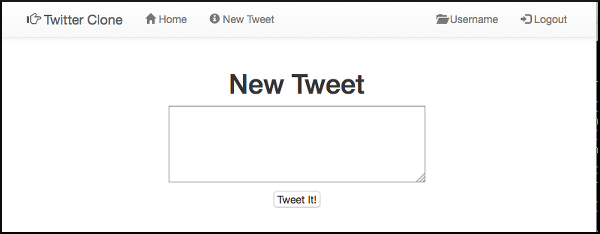
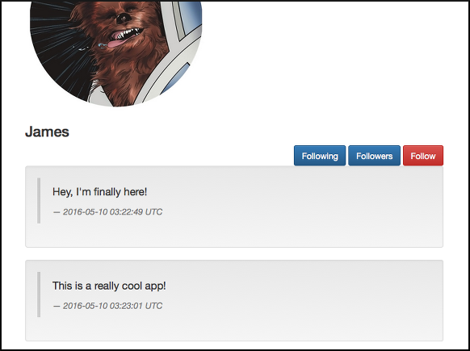
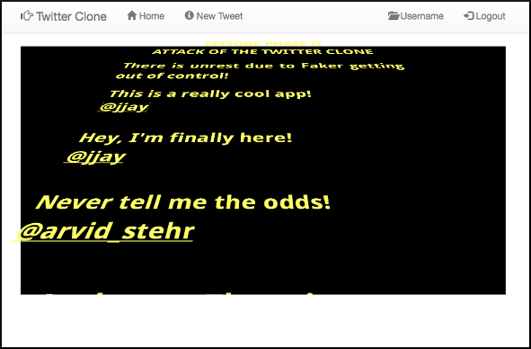

# twitter-clone

## Overview

A web application that allows users to share their thoughts in only a few 
sentences.

Demo at https://twitterclonest.herokuapp.com/

## Team

* [Buck Melton @buckmelton](https://github.com/buckmelton)
* [Mila Bessmann @ftBessmann](https://github.com/ftBessmann)
* [Kristal Lam @kristallam](https://github.com/kristallam)
* [Renan Martins @nbkhope](https://github.com/nbkhope)
* [Andrew Vathanakamsang @portatlas](https://github.com/portatlas)

## Technologies

* HTML
* CSS
* Bootstrap
* Ruby
* Sinatra

## Screenshots

  
*Screenshot 1*.  Home page

  
  
*Screenshot 2*.  Login page

  
  
*Screenshot 3*.  Profile page

  
  
*Screenshot 4*.  New tweet page

  
  
*Screenshot 5*.  Profile page with tweets

  
  
*Screenshot 6*.  User tweets featured on home page

  
  
*Screenshot 7*.  A certain user's followers list


## MVP Features

### Highest Priority
```
1 A user can log in and log out
1 A user can see others' profile pages with all their updates
1 A user can only post status updates of 140 characters or less
1 A user can post status updates
1 A user has a profile page
```

### Second-Highest Priority
```
2 A user has followers
2 A user can follow other users
2 A user can see a list of their followers
2 A user can see a list of who they are following
```

### Second-Lowest Priority
```
3 A user can see updates from those they are following
3 A user can see others' profile pages
```

### Lowest Priority
```
4 A user sees a responsively styled site
4 A user can retweet others' status updates
4 A user sees a styled site
4 A user can link a gravatar image
4 A user can view the site live on the web
4 A user can have a solid experience because the site is fully tested
```
